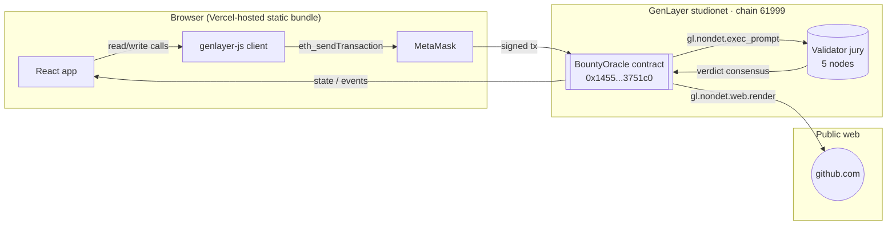
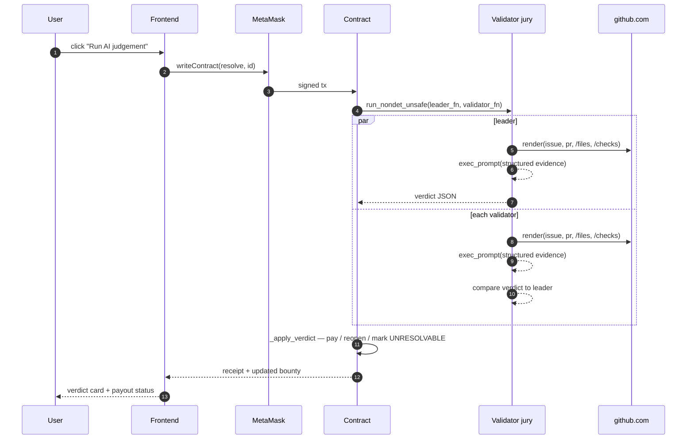
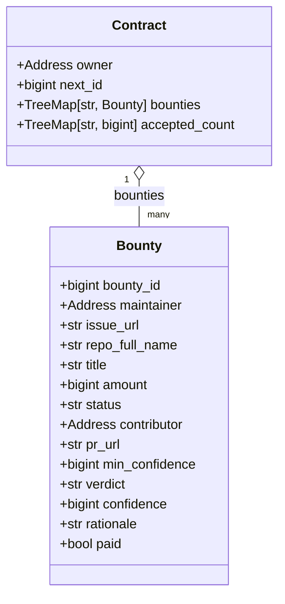
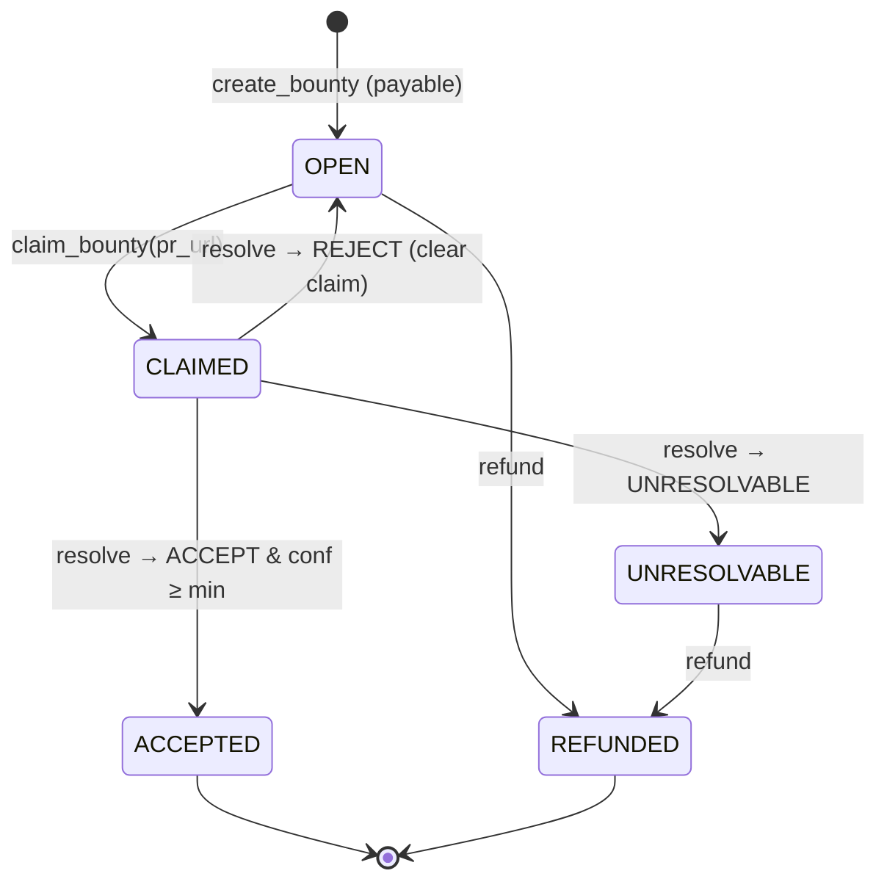
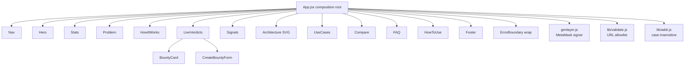

# Architecture

BountyOracle is one Intelligent Contract on GenLayer studionet plus a
static Vercel-hosted frontend that speaks to it through
`window.ethereum`. There is no bespoke backend, no queue, no cron —
every user-visible state change is a real transaction against the
contract.

This document is the layering, the sequences, and the storage model.

---

## System diagram

The client never talks to GitHub directly. `resolve()` triggers each
validator to fetch GitHub pages themselves; the resulting verdict lands
inside the contract's storage and is what the client reads back.

---

## `resolve()` sequence

The validator function returns `False` on any exception path, so a
crashed validator counts as a Disagree — never as a silent agreement.

---

## Storage model

Every persisted integer is `bigint` (see
[ADR 0001](docs/adr/0001-run-nondet-unsafe.md#storage-types)); bare
`int` is forbidden as a storage type by the simulator.

TreeMap keys are always `str` — calldata only supports string-keyed
maps, so bounty ids are stored as `str(bounty_id)` and addresses as
their `.as_hex` string.

---

## State machine

`ACCEPTED` and `REFUNDED` are terminal. `paid = True` is the
double-payout guard; `_apply_verdict` refuses to release if it is
already set.

---

## Frontend composition

`App.jsx` is composition only. Sections are presentational — the only
one that owns writes is `LiveVerdicts`, and it consumes the wallet
state via props.

---

## Failure modes

| Failure | Where | User-facing behaviour |
|---|---|---|
| Wallet on wrong chain | `wallet_switchEthereumChain` prompt refused | Banner: switch chain manually, then retry |
| GitHub page 404 in leader | `_safe_render` returns `None` | Verdict = `UNRESOLVABLE`, maintainer may refund |
| LLM output not JSON | `_normalize_verdict` coerces | Verdict = `UNRESOLVABLE` with a diagnostic rationale |
| Validator quorum not reached | `run_nondet_unsafe` returns error | State unchanged; the same `resolve()` can be re-called |
| React section throws | `ErrorBoundary` catches | Boxed error inline; other sections stay interactive |

---

## References

- Contract source: [`contracts/BountyOracle.py`](contracts/BountyOracle.py)
- Frontend entry: [`frontend/src/App.jsx`](frontend/src/App.jsx)
- SDK client: [`frontend/src/genlayer.js`](frontend/src/genlayer.js)
- Threat model: [`SECURITY.md`](SECURITY.md)
- Decision records: [`docs/adr/`](docs/adr/)
