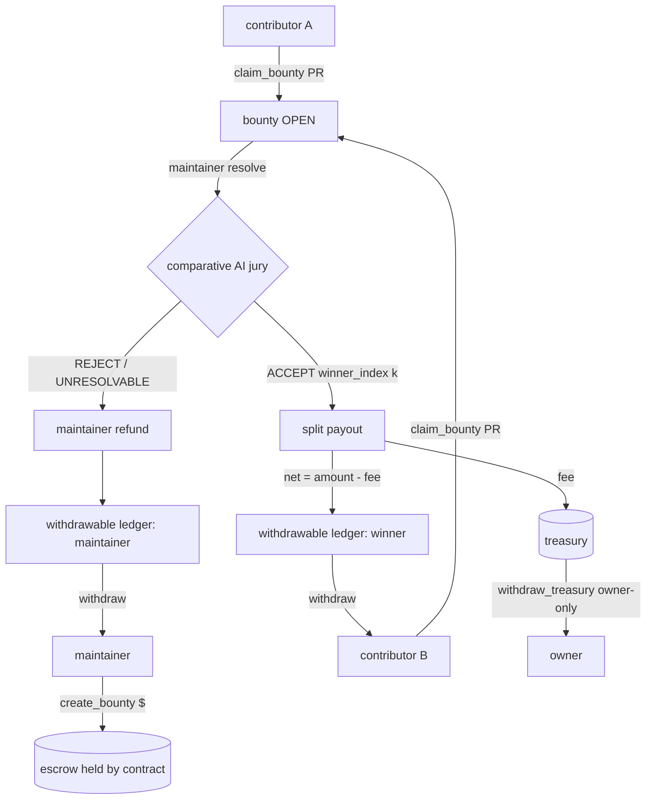

# BountyOracle — Economics (v0.5, Phase 4)

This document describes the escrow economics introduced in Phase 4:
pull-payment settlement, the protocol fee + treasury, and the tiered
reputation system that discounts that fee for proven contributors.

Contract (studionet, v0.5): `0xb15DCff4869C7D49be9aEaFFc9C21157e4a0184F`

---

## 1. Money flow



Nothing is pushed during settlement. `resolve()` and `refund()` only
**credit a ledger**; funds leave the contract solely through `withdraw()`
(for contributors/maintainers) or `withdraw_treasury()` (owner). This is the
classic pull-payment pattern and follows checks-effects-interactions: the
ledger entry is zeroed *before* the external `emit_transfer`.

**Why it matters:** if a payout recipient were a contract that reverts on
receipt, a push-based settlement would revert the whole `resolve()` and could
strand every other party. With pull payments, one bad recipient only affects
their own withdrawal.

---

## 2. Protocol fee

A winning payout is split:

```
fee = amount * fee_bps / 10000
net = amount - fee            # credited to the winner
treasury += fee               # swept later by the owner
```

`BASE_FEE_BPS = 250` (2.5%). The **effective** `fee_bps` depends on the
winner's reputation tier at the moment of the win.

---

## 3. Reputation tiers

Tiers are derived from a contributor's lifetime accepted **wins** (counted
*before* the current win, so a first win is charged the Newcomer rate).

| Tier        | Wins   | Fee paid | Discount vs base |
|-------------|--------|----------|------------------|
| Newcomer    | 0–1    | 2.50%    | —                |
| Contributor | 2–4    | 1.75%    | 30%              |
| Trusted     | 5–9    | 1.00%    | 60%              |
| Expert      | 10+    | 0.00%    | 100%             |

The discount is a retention incentive: the more real work a contributor has
shipped through the oracle, the more of each future bounty they keep. Every
contributor also accrues a lifetime `earned` total (net of fees), surfaced on
the leaderboard.

---

## 4. On-chain surfaces

| View | Returns |
|---|---|
| `get_withdrawable(addr)` | claimable base units for `addr` |
| `get_treasury()` | accrued protocol fees |
| `get_fee_bps()` | the base fee (250) |
| `get_reputation_full(addr)` | `{accepted, earned, tier, tier_name, fee_bps}` |
| `get_leaderboard()` | winners ranked by wins then earned |

| Write | Who | Effect |
|---|---|---|
| `withdraw()` | anyone with a balance | pulls their credited GEN (CEI) |
| `withdraw_treasury()` | owner only | sweeps accrued fees |

---

## 5. GenLayer fit

The fee discount is driven by reputation that is itself a product of the
on-chain **AI jury** deciding real GitHub work is complete. The economics are
inseparable from the thing only GenLayer can do: a contract that reads
github.com and judges code quality. Reputation here is not self-declared or
airdropped — it is *earned* by shipping merged-quality work that an on-chain
LLM panel agreed resolved a real issue.
